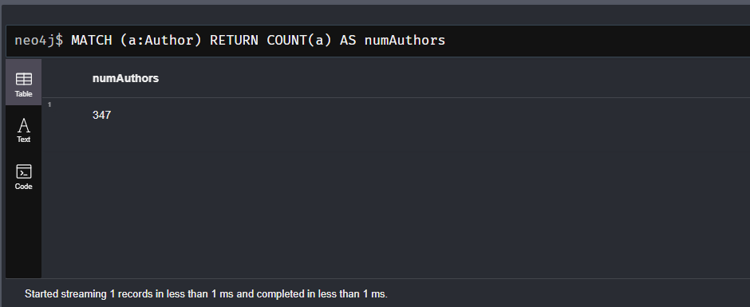
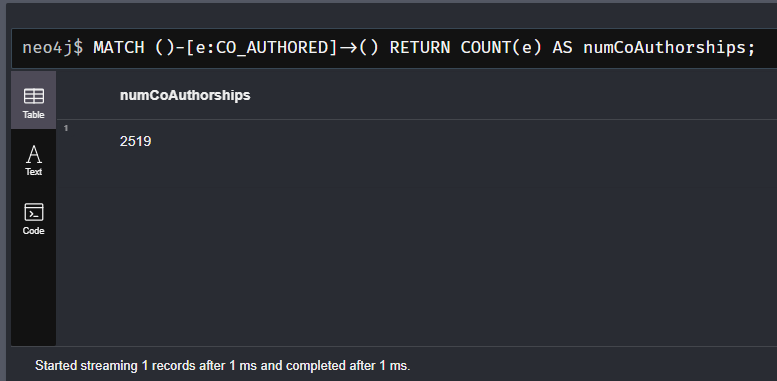
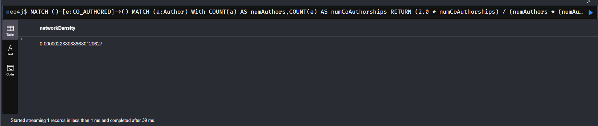
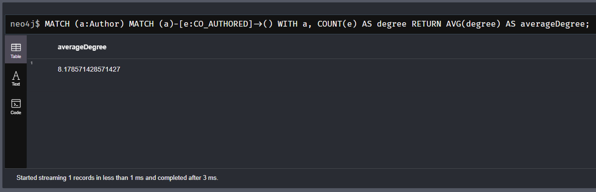
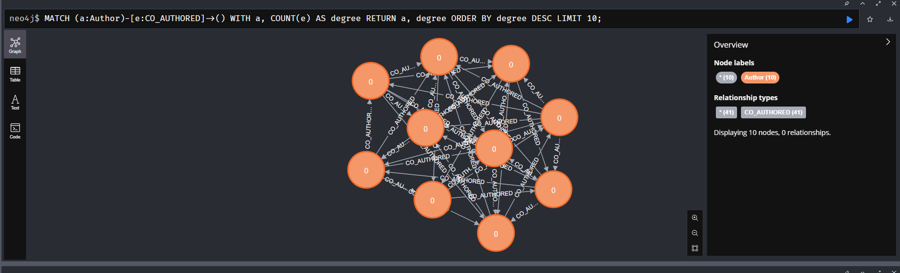

# Unveiling Patterns: Data Exploration and Visualization

## Overview

In this project, we conducted an exploratory data analysis and visualization of a given dataset. The dataset contains information about authors and their co-authorships in a network. By utilizing Cypher commands and visualization techniques, we aimed to uncover patterns and insights within the data.

## Data Exploration

### Total Number of Authors

We executed Cypher commands to determine the total number of authors in the dataset. This information provides an understanding of the scale of the network.

### Total Number of Co-Authorships

We also analyzed the total number of co-authorships in the dataset. This statistic provides insights into the collaboration dynamics among authors.

### Network Density

To measure the network density, we visualized the density of connections between authors in the graph. Network density gives us an idea of how closely connected authors are within the network.

### Average Degree of Nodes

We calculated and visualized the average degree of each node in the graph. This metric helps us understand the average number of co-authors each author has.

### Nodes with Highest Degree

We identified nodes with the highest degrees in the graph. These nodes represent authors who have collaborated with a large number of other authors.

## Conclusion

By exploring the dataset and performing visual analysis, we gained valuable insights into the patterns and characteristics of author collaborations. This analysis sets the foundation for further exploration and modeling tasks, such as community detection and recommendation systems.

For more details and code, please refer to the provided notebooks and scripts.

**Note:** The images shown in this README are examples and placeholders. Actual images from your analysis should be included in their respective sections.

