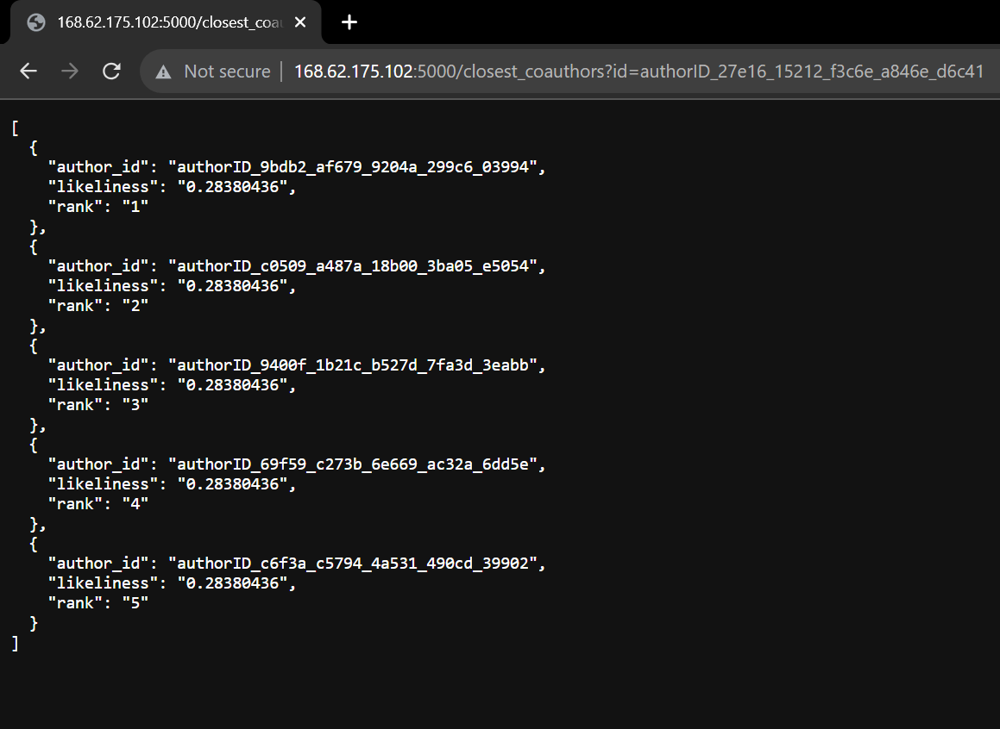

# Unveiling Patterns: Data Exploration and Visualization

## Overview

In this project, I conducted an exploratory data analysis and visualization of a given dataset. The dataset contains information about authors and their co-authorships in a network. By utilizing Cypher commands and visualization techniques, I aimed to uncover patterns and insights within the data.

## Data Exploration

### Total Number of Authors

I executed Cypher commands to determine the total number of authors in the dataset. This information provides an understanding of the scale of the network.

### Total Number of Co-Authorships

I also analyzed the total number of co-authorships in the dataset. This statistic provides insights into the collaboration dynamics among authors.

### Network Density

To measure the network density, I visualized the density of connections betIen authors in the graph. Network density gives us an idea of how closely connected authors are within the network.

### Average Degree of Nodes

I calculated and visualized the average degree of each node in the graph. This metric helps us understand the average number of co-authors each author has.

### Nodes with Highest Degree

I identified nodes with the highest degrees in the graph. These nodes represent authors who have collaborated with a large number of other authors.

## Conclusion

By exploring the dataset and performing visual analysis, I gained valuable insights into the patterns and characteristics of author collaborations. This analysis sets the foundation for further exploration and modeling tasks, such as community detection and recommendation systems.

For more details and code, please refer to the provided notebooks and scripts.

**Note:** The images shown in this README are examples and placeholders. Actual images from your analysis should be included in their respective sections.

# Crafting Tomorrow's Chapters

## Data Preperation

### Data Cleaning

I executed follwing Python Script Containing cypher query while creating a local Graph using networkx to eliminate author which do not have any CoAuthorship relations

### Data Formatting

In the Following Code snippet I have Changed the format of Graph to a tensor so that we can prepare it for training for GNN Model

### Formatted Data Analysis

In the Following Python code snippet I have analyzed the Formatted data to state the details

### Training the Data

In the Following code snippet I defined a GNN Model and declaring Mean Square Error and Adam optimizers as loss function and then splitting the data into training and test sets and thus training the model and saving it using pytorch.

### Calling the Model

I have created the following get_closest_suthors function to get the Top 5 Most closest Coauthors.

## Conclusion

By setting appropriate parameters and loss functions I have trained the model and Saved it via pytorch so that it is stored in the local storage and can be called from there.

# Cloud Chronicles 

## Creating app.py

Following is the main Flask based app.py file which calls the model.pt, data.pickle and author_to_index.pickle to run as a localhost and serve to requests.

## Virtual Machine to Host the app.py

Following is the dashboard of a VM created on Azure to run app.py on a public IP to serve all requests of format: http://168.62.175.102:5000/closest_coauthors?id="Your_author_id"

## Conclusion

Thus For this project I have used azure to create a VM, MobaXTerm to access the VM and run app.py on it.

Following are the Results for requests of 3 Different Author ID's 

### Author 1

### Author 2

### Author 3

